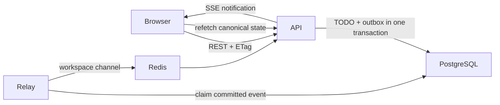

# SleekFlow TODO

A production-shaped modular monolith for a shared TODO workspace. It implements the required CRUD, recurrence, dependencies, filtering/sorting, concurrent access, retained deletion, and 10,000-item behavior, plus authentication and real-time refresh.

## Run the application

Docker Desktop is the only required runtime:

```bash
make dev
```

Open [http://localhost:3000](http://localhost:3000). Register a user, or load the repeat-safe performance fixture in another terminal:

```bash
make seed
```

The fixture login is `demo@example.com` / `demo-password-123`. API documentation is available at [http://localhost:3000/api/docs](http://localhost:3000/api/docs).

`Ctrl-C` stops the foreground stack. `make down` removes containers but preserves PostgreSQL/Redis data; `make reset` explicitly removes those named volumes.

## Local development

With Node.js 22+, PostgreSQL, and Redis available locally:

```bash
cp .env.example .env
npm install
npm run generate
npm run migrate
npm run dev
```

Vite runs on `http://localhost:5173` and proxies API requests to port 8080. Adjust `.env` URLs when the services are not on their defaults.

Useful commands:

```bash
npm test                 # unit/component tests
npm run test:integration # PostgreSQL integration suite (requires services)
npm run typecheck
npm run build
npm run generate         # regenerate TS types from api/openapi.yaml
docker compose config --quiet
```

## Repository structure

```text
api/openapi.yaml             OpenAPI 3.1 source of truth
apps/api/src/
  auth/                      Argon2id, Redis sessions, CSRF, rate limiting
  domain/                    Recurrence, cursor, ordering, domain errors
  modules/todos/             TODO queries and transactional rules
  modules/workspaces/        Membership and authorization
  http/                      Express transport, SSE, ETags, middleware
  scripts/                   Migration and 10,000-row seed commands
apps/web/src/                React application and generated shadcn/ui sources
packages/contracts/          OpenAPI-generated shared TypeScript contract
migrations/                  Ordered, transactional PostgreSQL migrations
compose.yaml                 PostgreSQL, Redis, migrate, API, relay, web
```

The API, migration command, and relay are separate entry points over the same backend modules. The API remains stateless: sessions and rate limits live in Redis; application state and outbox events live in PostgreSQL.

## Correctness and security

- Every TODO mutation requires an `If-Match` version and increments that version. A stale writer receives `412` and the browser retains its draft.
- Dependency graph changes use serializable transactions and reject self/cross-workspace/duplicate/cyclic edges.
- Completing a recurring TODO and inserting its next scheduled occurrence happen in one transaction. A unique `(series, sequence)` index makes retries safe.
- Delete is a soft delete. Active dependent TODOs prevent hiding a prerequisite.
- Passwords use Argon2id. Redis stores only a SHA-256 digest of each opaque session token. Browser mutations require the session CSRF secret and a trusted origin.
- Local Compose uses a non-`Secure` cookie so plain `http://localhost` works. Set `COOKIE_SECURE=true` behind production TLS; that switches to the `__Host-todo_session` cookie.
- SQL sort expressions are selected from a static allow-list; values are always parameters. All reads and writes are workspace-authorized.

## Real-time flow



Redis Pub/Sub may duplicate a notification if the relay fails between publish and acknowledgment. Event IDs and monotonic TODO versions make duplicates harmless. Reconnect and window focus invalidate the current workspace to reconcile missed notifications.

See [decision.md](decision.md) for scope and trade-offs, [docs/architecture.md](docs/architecture.md) for the production target, [docs/performance.md](docs/performance.md) for the 10,000-row baseline, and [PLAN.md](PLAN.md) for the full implementation plan.
